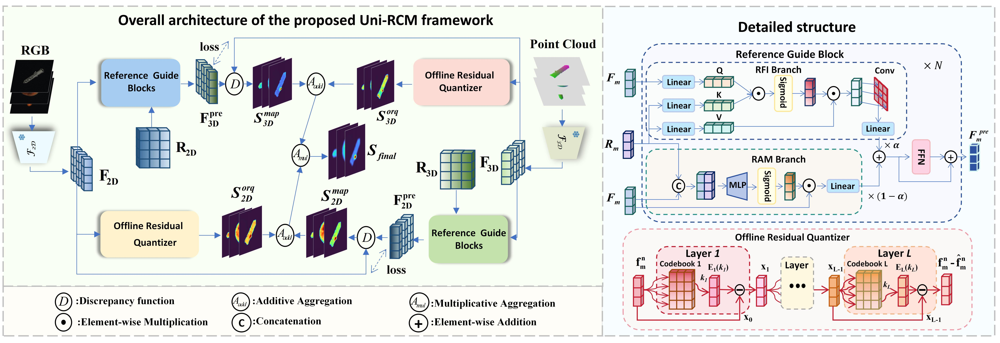

<<<<<<< HEAD
<div align="center">

<h1>Unified Reference-guided Cross-modal Mapping for Multi-Class Anomaly Detection</h1>


[](https://ieeexplore.ieee.org/document/11540428/)

</div>


# :bookmark_tabs: Introduction

Multi-modal industrial anomaly detection typically relies on separate models trained for each product category, which fundamentally limits practical scalability. Shifting to a unified paradigm that handles diverse classes simultaneously often causes detection accuracy to degrade, due to inter-class interference and feature manifold confusion.To address these challenges, we propose **Uni-RCM**, a **Unified Reference-guided Cross-modal Mapping** framework. Its core component is a *Reference Guide Block* that dynamically filters out category-specific noise by introducing a learnable reference feature encoding cross-modal commonalities. We also propose an *Offline Residual Quantizer (ORQ)* that characterizes the normal feature distribution through multiple cascaded codebooks.Extensive experiments on MVTec 3D-AD demonstrate state-of-the-art performance in the multi-class setting, covering both image-level detection and pixel-level localization.

<div align="center">
  
</div>


# :envelope: Environment

Python 3.9 and PyTorch 2.0 with CUDA 11.7 are recommended. Install PyTorch first:

```bash
pip install torch==2.0.0+cu117 torchvision==0.15.1+cu117 \
    --extra-index-url https://download.pytorch.org/whl/cu117
```

Then install the remaining dependencies:

```bash
pip install -r requirements.txt
```


# :file_cabinet: Dataset

Download **MVTec 3D-AD** from the [official page](https://www.mvtec.com/research-teaching/datasets/mvtec-3d-ad/downloads) and extract it. The expected folder structure is:

```
mvtec3d/
├── bagel/
│   ├── train/
│   │   └── good/
│   │       ├── rgb/
│   │       └── xyz/
│   ├── validation/
│   │   └── good/
│   │       ├── rgb/
│   │       └── xyz/
│   └── test/
│       ├── good/
│           ├── rgb/
│           ├── xyz/
│           └── gt/
│       └── <defect_type>/
│           ├── rgb/
│           ├── xyz/
│           └── gt/
├── cable_gland/
│   └── ...
└── tire/
    └── ...
```

# :inbox_tray: Pre-trained Backbone Weights

Uni-RCM uses two frozen pre-trained backbones for feature extraction:

| Backbone | Where to get it |
|---|---|
| DINO ViT-B/8 | [facebookresearch/dino](https://github.com/facebookresearch/dino) — `dino_vitbase8_pretrain.pth` |
| Point-MAE | [Pang-Yatian/Point-MAE](https://github.com/Pang-Yatian/Point-MAE) — `pointmae_pretrain.pth` |
---

After downloading, open `models/full_extraction_models.py` and set the two path constants near the top of the file:

```python
DINO_CHECKPOINT_PATH = '/path/to/dino_vitbase8_pretrain.pth'
PointMAE_CHECKPOINT_PATH = '/path/to/pointmae_pretrain.pth'
```

> **:link: All pretrained weights are available here:**
> [Download](https://drive.google.com/drive/folders/1uzqKJ8Zu19qJVPUcwbZHTZk81H_r1o0x?usp=drive_link)


# :rocket: Step-by-Step Usage

All commands below are run from the **repository root**. Replace `/path/to/mvtec3d` with the actual path to your extracted dataset.


### Step 1 — Preprocess the Dataset

This step applies background plane removal and connected-component cleaning to the raw point clouds. **It modifies the TIFF files in place**, so keep a backup of the original data if needed.

```bash
python processing/preprocess_mvtec.py /path/to/mvtec3d
```


### Step 2 — Build the Combined Training Set

Uni-RCM trains a single model on all 10 classes jointly. This script merges the training samples from each class into a unified `combine/` directory under the dataset root:

```bash
python processing/combine_train_data.py /path/to/mvtec3d
```

The resulting structure looks like:

```
mvtec3d/
└── combine/
    └── train/
        └── good/
            ├── rgb/   (bagel_000.png, cable_gland_000.png, ...)
            └── xyz/   (bagel_000.tiff, cable_gland_000.tiff, ...)
```

### Step 3 — Extract ORQ Codebooks

This step runs K-Means on frozen training features to build the ORQ codebooks. It only needs to be done once:

```bash
python uni_rcm_extract_orq.py \
    --dataset_path /path/to/mvtec3d \
    --class_name combine \
    --checkpoint_savepath ./checkpoints/checkpoints_UniRCM_ORQ
```

The codebook checkpoint is saved to:

```
./checkpoints/checkpoints_UniRCM_ORQ/combine/UniRCM_ORQ_combine_Krgb4096_Kxyz1024_L4_iter20.pth
```

Key arguments (defaults already match the paper):

| Argument | Default | Description |
|---|---|---|
| `--num_embeddings_rgb` | 4096 | RGB codebook size |
| `--num_embeddings_xyz` | 1024 | XYZ codebook size |
| `--vq_layers` | 4 | Number of residual VQ layers |
| `--orq_epochs` | 20 | K-Means iterations |


### Step 4 — Train

Train the unified Uni-RCM model on the combined dataset:

```bash
python uni_rcm_train.py \
    --dataset_path /path/to/mvtec3d \
    --class_name combine \
    --checkpoint_savepath ./checkpoints/checkpoints_UniRCM \
    --epochs_no 200 \
    --batch_size 32 \
    --hidden_dim 512 \
    --num_blocks 3
```

The model checkpoint is saved as:

```
./checkpoints/checkpoints_UniRCM/combine/UniRCM_combine_200ep_32bs_h512_L3.pth
```

### Step 5 — Inference

Evaluation is performed **per class**. Run inference for each of the 10 MVTec 3D-AD categories.

```bash
for CLASS in bagel cable_gland carrot cookie dowel foam peach potato rope tire; do
    python uni_rcm_infer.py \
        --dataset_path /path/to/mvtec3d \
        --class_name $CLASS \
        --checkpoint_folder ./checkpoints/checkpoints_UniRCM \
        --checkpoint_class_name combine \
        --orq_checkpoint ./checkpoints/checkpoints_UniRCM_ORQ/combine/UniRCM_ORQ_combine_Krgb4096_Kxyz1024_L4_iter20.pth \
        --quantitative_folder ./results/quantitatives_uni_rcm
done
```


Per-class metric files are written to `./results/quantitatives_uni_rcm/`.

> **Optional flags**: add `--produce_qualitatives` to save side-by-side visualization figures, and `--qualitative_folder` to set a custom output directory.

### Step 6 — Aggregate Results

Once all 10 classes have been evaluated, run the aggregation script to print a summary table and export a CSV:

```bash
python processing/aggregate_results.py \
    --quantitative_folder ./results/quantitatives_uni_rcm \
    --output_file ./results/aggregated_results.csv
```

# :bulb: Training Monitoring

Training metrics are logged with [SwanLab](https://github.com/SwanHubX/SwanLab) by default. Set your API key in `uni_rcm_train.py`:

```python
swl.login(api_key="your_api_key")
```

To disable logging (e.g. for offline or debug runs), uncomment `mode='disabled'` inside `swl.init(...)`:

```python
swl.init(
    project='Uni-RCM',
    experiment_name=model_name,
    config=vars(args),
    mode='disabled'
)
```

If you prefer **Weights & Biases**, install it and replace the SwanLab calls accordingly:

```bash
pip install wandb
```

Substitute `swl.login(...)`, `swl.init(...)`, and `swl.log(...)` with their `wandb` equivalents (`wandb.init(...)` and `wandb.log(...)`).

---

# :pray: Acknowledgements

We sincerely thank the authors of the following works, whose code and ideas were essential to building Uni-RCM: [M3DM](https://github.com/nomewang/M3DM), [CFM](https://github.com/CVLAB-Unibo/crossmodal-feature-mapping), and [G2SF](https://github.com/ctaoaa/G2SF).


=======
Our model weights and execution scripts will be released shortly.
>>>>>>> 116c3e7423d2a45315946a6004862e68af87aaef
